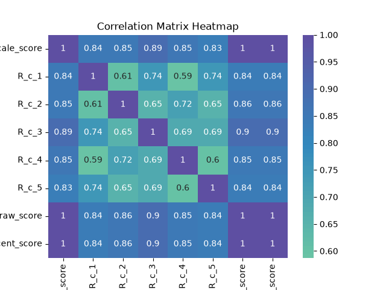
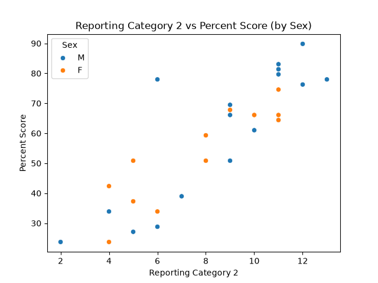
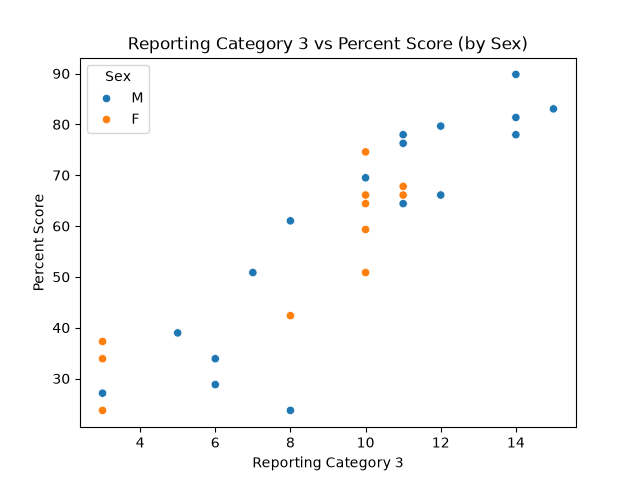
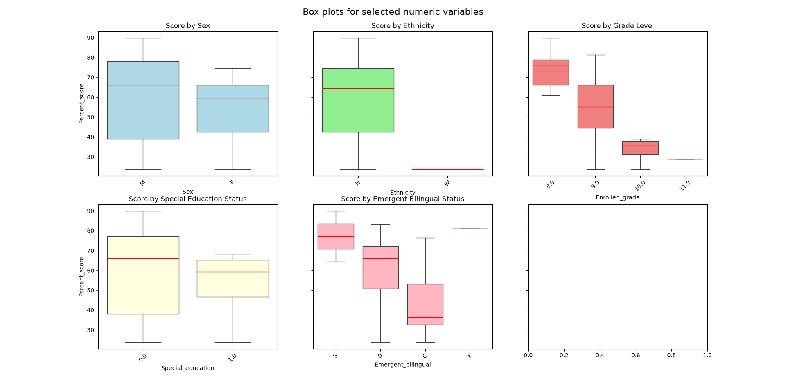

# datafun-06-applied

[](https://denisecase.github.io/pro-analytics-02/workflow-b-apply-example-project/)
[](./pyproject.toml)
[](./LICENSE)

> Professional Python project: applied data analytics.

## Project Goal

This project was performed to analyze Algebra I End of Course scores.
The data set was obtained locally, with all sensitive student data (anything that could identify a student) removed.
The goal of this project was to read the data into a table from a .csv file, clean the data, and then perform basic analysis on the data to look for patterns and implications.

## Working Files

You'll work with these areas:

- **data/raw** - raw data for exploration - uses student_test_data.csv
- **docs/** - project narrative and documentation
- **src/** - supporting Python package modules - uses app_test_data_hasacco.py
- **notebooks/** - interactive analysis
- **pyproject.toml** - update authorship & links
- **zensical.toml** - update authorship & links

### In a machine terminal (open in your `Repos` folder)

After you get a copy of this repo in your own GitHub account,
open a machine terminal in your `Repos` folder:

```shell
# Replace username with YOUR GitHub username.
git clone https://github.com/hasacco/datafun-06-applied

cd datafun-06-applied
code .
```

### In a VS Code terminal

These are listed for convenience.
For best results, follow the detailed instructions in
[pro-analytics-02 guide](https://denisecase.github.io/pro-analytics-02/).

```shell
uv self update
uv python pin 3.14
uv lock --upgrade
uv sync --extra dev --extra docs --upgrade

uvx pre-commit install

git add -A
uvx pre-commit run --all-files
# repeat if changes were made
uvx pre-commit run --all-files

# run the module and verify the environment (.venv/)
uv run python -m datafun.app_test_data_hasacco

# do chores
uv run python -m pyright
uv run python -m pytest
uv run python -m zensical build

# save progress
git add -A
git commit -m "update"
git push -u origin main
```

</details>

## Example Output

```shell
2026-06-19 17:28:15 | INFO | P06 | === RUN START ===
2026-06-19 17:28:15 | INFO | P06 | project=P06
2026-06-19 17:28:15 | INFO | P06 | repo_dir=datafun-06-applied
2026-06-19 17:28:15 | INFO | P06 | python=3.14.5
2026-06-19 17:28:15 | INFO | P06 | os=Windows 11
2026-06-19 17:28:15 | INFO | P06 | shell=powershell
2026-06-19 17:28:15 | INFO | P06 | cwd=.
2026-06-19 17:28:15 | INFO | P06 | github_actions=False
2026-06-19 17:28:15 | INFO | P06 | === RUN START ===
2026-06-19 17:28:15 | INFO | P06 | project=P06
2026-06-19 17:28:15 | INFO | P06 | repo_dir=datafun-06-applied
2026-06-19 17:28:15 | INFO | P06 | python=3.14.5
2026-06-19 17:28:15 | INFO | P06 | os=Windows 11
2026-06-19 17:28:15 | INFO | P06 | shell=powershell
2026-06-19 17:28:15 | INFO | P06 | cwd=.
2026-06-19 17:28:15 | INFO | P06 | github_actions=False
2026-06-19 17:28:15 | INFO | P06 | === RUN START ===
2026-06-19 17:28:15 | INFO | P06 | project=EDA
2026-06-19 17:28:15 | INFO | P06 | repo_dir=datafun-06-applied
2026-06-19 17:28:15 | INFO | P06 | python=3.14.5
2026-06-19 17:28:15 | INFO | P06 | os=Windows 11
2026-06-19 17:28:15 | INFO | P06 | shell=powershell
2026-06-19 17:28:15 | INFO | P06 | cwd=.
2026-06-19 17:28:15 | INFO | P06 | github_actions=False
2026-06-19 17:28:15 | INFO | P06 | ========================
2026-06-19 17:28:15 | INFO | P06 | START main()
2026-06-19 17:28:15 | INFO | P06 | ========================
2026-06-19 17:28:15 | INFO | P06 | --- Section 2: Load dataset: student_test_data ---
2026-06-19 17:28:15 | INFO | P06 | Loading dataset: student_test_data
2026-06-19 17:28:15 | INFO | P06 | Loaded: 30 rows, 19 columns
2026-06-19 17:28:15 | INFO | P06 | --- Section 3: Inspect shape and basic structure ---
2026-06-19 17:28:15 | INFO | P06 | Previewing first few rows of the dataset
2026-06-19 17:28:15 | DEBUG | P06 |
   Enrolled_grade  Scale_score  Performance_level Sex Ethnicity  Eco_dis  Migrant Emergent_bilingual  \
0             8.0       4256.0                3.0   M         H      0.0      0.0                  S  
1             8.0       4293.0                3.0   F         H      0.0      0.0                  0  
2             8.0       4183.0                3.0   M         H      0.0      0.0                  0  
3             8.0       4293.0                3.0   F         H      0.0      0.0                  0  
4             8.0       5030.0                4.0   M         H      1.0      0.0                  S  

   English_second_language  Special_education  Gifted_talented  At_risk  R_c_1  R_c_2  R_c_3  R_c_4  R_c_5  \
0                      0.0                0.0              0.0      0.0    6.0   11.0   11.0    5.0    5.0  
1                      0.0                0.0              0.0      0.0    6.0   11.0   10.0    8.0    4.0  
2                      0.0                0.0              1.0      0.0    6.0   10.0    8.0    7.0    5.0  
3                      0.0                0.0              0.0      0.0    3.0   10.0   12.0    9.0    5.0  
4                      0.0                0.0              0.0      0.0    9.0   12.0   14.0   11.0    7.0  

   Total_raw_score  Percent_score  
0             38.0          64.41  
1             39.0          66.10  
2             36.0          61.02  
3             39.0          66.10  
4             53.0          89.83  
2026-06-19 17:28:15 | INFO | P06 | Column names
2026-06-19 17:28:15 | DEBUG | P06 | ['Enrolled_grade', 'Scale_score', 'Performance_level', 'Sex', 'Ethnicity', 'Eco_dis', 'Migrant', 'Emergent_bilingual', 'English_second_language', 'Special_education', 'Gifted_talented', 'At_risk', 'R_c_1', 'R_c_2', 'R_c_3', 'R_c_4', 'R_c_5', 'Total_raw_score', 'Percent_score']
2026-06-19 17:28:15 | INFO | P06 | DataFrame info (types and non-null counts)
<class 'pandas.DataFrame'>
RangeIndex: 30 entries, 0 to 29
Data columns (total 19 columns):
 #   Column                   Non-Null Count  Dtype  
---  ------                   --------------  -----  
 0   Enrolled_grade           30 non-null     float64
 1   Scale_score              30 non-null     float64
 2   Performance_level        30 non-null     float64
 3   Sex                      30 non-null     str  
 4   Ethnicity                30 non-null     str  
 5   Eco_dis                  30 non-null     float64
 6   Migrant                  30 non-null     float64
 7   Emergent_bilingual       30 non-null     str  
 8   English_second_language  30 non-null     float64
 9   Special_education        30 non-null     float64
 10  Gifted_talented          30 non-null     float64
 11  At_risk                  30 non-null     float64
 12  R_c_1                    30 non-null     float64
 13  R_c_2                    30 non-null     float64
 14  R_c_3                    30 non-null     float64
 15  R_c_4                    30 non-null     float64
 16  R_c_5                    30 non-null     float64
 17  Total_raw_score          30 non-null     float64
 18  Percent_score            30 non-null     float64
dtypes: float64(16), str(3)
memory usage: 4.6 KB
2026-06-19 17:28:15 | INFO | P06 | Dataset shape: 30 rows, 19 columns
2026-06-19 17:28:15 | INFO | P06 | --- Section 4: Create Data Dictionary and Check Data Quality ---
2026-06-19 17:28:15 | INFO | P06 | Building starter data dictionary
2026-06-19 17:28:15 | DEBUG | P06 |
                     column    dtype  missing_count  missing_pct
0            Enrolled_grade  float64              0          0.0
1               Scale_score  float64              0          0.0
2         Performance_level  float64              0          0.0
3                       Sex      str              0          0.0
4                 Ethnicity      str              0          0.0
5                   Eco_dis  float64              0          0.0
6                   Migrant  float64              0          0.0
7        Emergent_bilingual      str              0          0.0
8   English_second_language  float64              0          0.0
9         Special_education  float64              0          0.0
10          Gifted_talented  float64              0          0.0
11                  At_risk  float64              0          0.0
12                    R_c_1  float64              0          0.0
13                    R_c_2  float64              0          0.0
14                    R_c_3  float64              0          0.0
15                    R_c_4  float64              0          0.0
16                    R_c_5  float64              0          0.0
17          Total_raw_score  float64              0          0.0
18            Percent_score  float64              0          0.0
2026-06-19 17:28:15 | INFO | P06 | Missing values per column:
2026-06-19 17:28:15 | INFO | P06 |
Enrolled_grade             0
Scale_score                0
Performance_level          0
Sex                        0
Ethnicity                  0
Eco_dis                    0
Migrant                    0
Emergent_bilingual         0
English_second_language    0
Special_education          0
Gifted_talented            0
At_risk                    0
R_c_1                      0
R_c_2                      0
R_c_3                      0
R_c_4                      0
R_c_5                      0
Total_raw_score            0
Percent_score              0
dtype: int64
2026-06-19 17:28:15 | INFO | P06 | Checking missing values per column
2026-06-19 17:28:15 | DEBUG | P06 |
Enrolled_grade             0
Scale_score                0
Performance_level          0
Sex                        0
Ethnicity                  0
Eco_dis                    0
Migrant                    0
Emergent_bilingual         0
English_second_language    0
Special_education          0
Gifted_talented            0
At_risk                    0
R_c_1                      0
R_c_2                      0
R_c_3                      0
R_c_4                      0
R_c_5                      0
Total_raw_score            0
Percent_score              0
dtype: int64
2026-06-19 17:28:15 | INFO | P06 | Duplicate rows detected: 0
2026-06-19 17:28:15 | INFO | P06 | Call describe() for numeric columns
2026-06-19 17:28:15 | DEBUG | P06 |
       Scale_score      R_c_1      R_c_2      R_c_3      R_c_4      R_c_5  Total_raw_score  Percent_score
count    30.000000  30.000000  30.000000  30.000000  30.000000  30.000000         30.00000      30.000000
mean   4134.533333   5.400000   8.333333   9.166667   6.533333   4.666667         34.10000      57.797333
std     448.264987   2.094327   2.974992   3.484778   2.738403   2.170862         11.56794      19.606948
min    3358.000000   1.000000   2.000000   3.000000   0.000000   0.000000         14.00000      23.730000
25%    3747.000000   4.000000   6.000000   7.000000   5.000000   3.000000         23.50000      39.827500
50%    4256.000000   6.000000   9.000000  10.000000   7.000000   5.000000         38.00000      64.410000
75%    4457.500000   7.000000  11.000000  11.000000   9.000000   6.000000         43.25000      73.307500
max    5030.000000   9.000000  13.000000  15.000000  11.000000   7.000000         53.00000      89.830000

2026-06-19 17:28:15 | INFO | P06 | --- Section 5: Create a cleaned view for EDA ---
2026-06-19 17:28:15 | INFO | P06 | Creating cleaned view for EDA (dropping rows with key missing values)
2026-06-19 17:28:15 | DEBUG | P06 | Columns required to be non-missing: ['Scale_score', 'R_c_1', 'R_c_2', 'R_c_3', 'R_c_4', 'R_c_5', 'Total_raw_score', 'Percent_score', 'Sex', 'Ethnicity', 'Enrolled_grade', 'Special_education', 'Emergent_bilingual']
2026-06-19 17:28:15 | INFO | P06 | Original rows: 30
2026-06-19 17:28:15 | INFO | P06 | Clean rows:    30
2026-06-19 17:28:15 | INFO | P06 | Rows dropped:  0
2026-06-19 17:28:15 | INFO | P06 | --- Section 6: Descriptive statistics for numeric columns ---
2026-06-19 17:28:15 | INFO | P06 | --------------- Manual statistics ---------------
2026-06-19 17:28:15 | DEBUG | P06 | Percent_score Statistics (using numpy):
2026-06-19 17:28:15 | DEBUG | P06 |   Mean: 57.80
2026-06-19 17:28:15 | DEBUG | P06 |   Std Dev: 19.28
2026-06-19 17:28:15 | DEBUG | P06 |   Min: 23.73
2026-06-19 17:28:15 | DEBUG | P06 |   Max: 89.83
2026-06-19 17:28:15 | DEBUG | P06 |   Range: 66.10
2026-06-19 17:28:15 | INFO | P06 | --------------- Using pandas describe() method ---------------
2026-06-19 17:28:15 | INFO | P06 | Computing overall descriptive statistics
2026-06-19 17:28:15 | DEBUG | P06 |
                 count         mean         std      min        25%      50%        75%      max
Scale_score       30.0  4134.533333  448.264987  3358.00  3747.0000  4256.00  4457.5000  5030.00
R_c_1             30.0     5.400000    2.094327     1.00     4.0000     6.00     7.0000     9.00
R_c_2             30.0     8.333333    2.974992     2.00     6.0000     9.00    11.0000    13.00
R_c_3             30.0     9.166667    3.484778     3.00     7.0000    10.00    11.0000    15.00
R_c_4             30.0     6.533333    2.738403     0.00     5.0000     7.00     9.0000    11.00
R_c_5             30.0     4.666667    2.170862     0.00     3.0000     5.00     6.0000     7.00
Total_raw_score   30.0    34.100000   11.567940    14.00    23.5000    38.00    43.2500    53.00
Percent_score     30.0    57.797333   19.606948    23.73    39.8275    64.41    73.3075    89.83
2026-06-19 17:28:15 | INFO | P06 | --------------- Using pandas groupby() and agg() ---------------
2026-06-19 17:28:15 | INFO | P06 | Computing descriptive statistics by group
2026-06-19 17:28:15 | INFO | P06 |
Stacked view - easier to read in logs:
2026-06-19 17:28:15 | DEBUG | P06 |
                     count         mean         std      min      max
Sex  
F   Scale_score         13  4040.538462  338.246610  3358.00  4495.00
    R_c_1               13     4.769231    1.739437     1.00     7.00
    R_c_2               13     7.846154    2.733927     4.00    11.00
    R_c_3               13     8.307692    3.275785     3.00    12.00
    R_c_4               13     6.538462    2.025479     3.00     9.00
    R_c_5               13     4.461538    1.761410     1.00     7.00
    Total_raw_score     13    31.923077    9.241767    14.00    44.00
    Percent_score       13    54.107692   15.664011    23.73    74.58
M   Scale_score         17  4206.411765  515.490550  3358.00  5030.00
    R_c_1               17     5.882353    2.260596     1.00     9.00
    R_c_2               17     8.705882    3.177356     2.00    13.00
    R_c_3               17     9.823529    3.592271     3.00    15.00
    R_c_4               17     6.529412    3.242639     0.00    11.00
    R_c_5               17     4.823529    2.480809     0.00     7.00
    Total_raw_score     17    35.764706   13.103098    14.00    53.00
    Percent_score       17    60.618824   22.209086    23.73    89.83
2026-06-19 17:28:15 | DEBUG | P06 |
                           count         mean         std      min      max
Ethnicity  
H         Scale_score         29  4161.310345  431.091066  3358.00  5030.00
          R_c_1               29     5.448276    2.114342     1.00     9.00
          R_c_2               29     8.551724    2.772134     4.00    13.00
          R_c_3               29     9.206897    3.539363     3.00    15.00
          R_c_4               29     6.758621    2.487902     1.00    11.00
          R_c_5               29     4.827586    2.018998     0.00     7.00
          Total_raw_score     29    34.793103   11.120699    14.00    53.00
          Percent_score       29    58.972069   18.848964    23.73    89.83
W         Scale_score          1  3358.000000         NaN  3358.00  3358.00
          R_c_1                1     4.000000         NaN     4.00     4.00
          R_c_2                1     2.000000         NaN     2.00     2.00
          R_c_3                1     8.000000         NaN     8.00     8.00
          R_c_4                1     0.000000         NaN     0.00     0.00
          R_c_5                1     0.000000         NaN     0.00     0.00
          Total_raw_score      1    14.000000         NaN    14.00    14.00
          Percent_score        1    23.730000         NaN    23.73    23.73
2026-06-19 17:28:15 | DEBUG | P06 |
                                count         mean         std      min      max
Enrolled_grade  
8.0            Scale_score         11  4499.545455  254.146558  4183.00  5030.00
               R_c_1               11     6.909091    1.758098     3.00     9.00
               R_c_2               11    10.545455    1.863525     6.00    13.00
               R_c_3               11    11.636364    2.062655     8.00    15.00
               R_c_4               11     8.545455    1.634848     5.00    11.00
               R_c_5               11     5.909091    1.136182     4.00     7.00
               Total_raw_score     11    43.545455    5.298370    36.00    53.00
               Percent_score       11    73.806364    8.979966    61.02    89.83
9.0            Scale_score         14  4046.857143  388.310315  3358.00  4689.00
               R_c_1               14     4.857143    1.791310     1.00     7.00
               R_c_2               14     7.714286    2.757607     4.00    11.00
               R_c_3               14     8.714286    3.220811     3.00    14.00
               R_c_4               14     5.928571    2.525692     1.00    10.00
               R_c_5               14     4.785714    1.805060     2.00     7.00
               Total_raw_score     14    32.000000   10.347798    14.00    48.00
               Percent_score       14    54.238571   17.539146    23.73    81.36
10.0           Scale_score          4  3599.000000  167.437551  3358.00  3729.00
               R_c_1                4     4.250000    0.500000     4.00     5.00
               R_c_2                4     5.000000    2.160247     2.00     7.00
               R_c_3                4     4.750000    2.362908     3.00     8.00
               R_c_4                4     3.750000    2.629956     0.00     6.00
               R_c_5                4     2.000000    2.160247     0.00     5.00
               Total_raw_score      4    19.750000    4.031129    14.00    23.00
               Percent_score        4    33.475000    6.831420    23.73    38.98
11.0           Scale_score          1  3489.000000         NaN  3489.00  3489.00
               R_c_1                1     1.000000         NaN     1.00     1.00
               R_c_2                1     6.000000         NaN     6.00     6.00
               R_c_3                1     6.000000         NaN     6.00     6.00
               R_c_4                1     4.000000         NaN     4.00     4.00
               R_c_5                1     0.000000         NaN     0.00     0.00
               Total_raw_score      1    17.000000         NaN    17.00    17.00
               Percent_score        1    28.810000         NaN    28.81    28.81
2026-06-19 17:28:15 | DEBUG | P06 |
                                   count         mean         std      min      max
Special_education  
0.0               Scale_score         23  4168.434783  475.897413  3358.00  5030.00
                  R_c_1               23     5.565217    2.149547     1.00     9.00
                  R_c_2               23     8.695652    2.991424     2.00    13.00
                  R_c_3               23     9.173913    3.688461     3.00    15.00
                  R_c_4               23     6.695652    2.930014     0.00    11.00
                  R_c_5               23     4.739130    2.320215     0.00     7.00
                  Total_raw_score     23    34.869565   12.226292    14.00    53.00
                  Percent_score       23    59.101739   20.722760    23.73    89.83
1.0               Scale_score          7  4023.142857  349.163490  3358.00  4331.00
                  R_c_1                7     4.857143    1.951800     1.00     7.00
                  R_c_2                7     7.142857    2.794553     4.00    11.00
                  R_c_3                7     9.142857    2.968084     3.00    12.00
                  R_c_4                7     6.000000    2.081666     3.00     9.00
                  R_c_5                7     4.428571    1.718249     2.00     6.00
                  Total_raw_score      7    31.571429    9.431457    14.00    40.00
                  Percent_score        7    53.511429   15.985941    23.73    67.80
2026-06-19 17:28:15 | DEBUG | P06 |
                                    count         mean         std      min      max
Emergent_bilingual  
0                  Scale_score         19  4188.947368  389.803009  3358.00  4745.00
                   R_c_1               19     5.894737    1.791794     3.00     9.00
                   R_c_2               19     8.421053    3.024268     2.00    13.00
                   R_c_3               19     9.736842    3.106304     3.00    15.00
                   R_c_4               19     6.736842    2.765705     0.00    10.00
                   R_c_5               19     5.000000    1.914854     0.00     7.00
                   Total_raw_score     19    35.789474   10.293358    14.00    49.00
                   Percent_score       19    60.661053   17.446387    23.73    83.05
C                  Scale_score          8  3808.875000  389.786915  3358.00  4540.00
                   R_c_1                8     3.625000    1.922610     1.00     6.00
                   R_c_2                8     7.000000    2.672612     4.00    12.00
                   R_c_3                8     6.375000    2.924649     3.00    11.00
                   R_c_4                8     5.250000    2.121320     3.00    10.00
                   R_c_5                8     3.250000    2.434866     0.00     6.00
                   Total_raw_score      8    25.500000   10.433463    14.00    45.00
                   Percent_score        8    43.220000   17.683487    23.73    76.27
F                  Scale_score          1  4689.000000         NaN  4689.00  4689.00
                   R_c_1                1     6.000000         NaN     6.00     6.00
                   R_c_2                1    11.000000         NaN    11.00    11.00
                   R_c_3                1    14.000000         NaN    14.00    14.00
                   R_c_4                1    10.000000         NaN    10.00    10.00
                   R_c_5                1     7.000000         NaN     7.00     7.00
                   Total_raw_score      1    48.000000         NaN    48.00    48.00
                   Percent_score        1    81.360000         NaN    81.36    81.36
S                  Scale_score          2  4643.000000  547.300649  4256.00  5030.00
                   R_c_1                2     7.500000    2.121320     6.00     9.00
                   R_c_2                2    11.500000    0.707107    11.00    12.00
                   R_c_3                2    12.500000    2.121320    11.00    14.00
                   R_c_4                2     8.000000    4.242641     5.00    11.00
                   R_c_5                2     6.000000    1.414214     5.00     7.00
                   Total_raw_score      2    45.500000   10.606602    38.00    53.00
                   Percent_score        2    77.120000   17.974654    64.41    89.83
2026-06-19 17:28:15 | INFO | P06 | --- Section 7: Correlation matrix for numeric columns ---
2026-06-19 17:28:15 | INFO | P06 | Computing correlation matrix for numeric columns
2026-06-19 17:28:15 | INFO | P06 |
Correlation matrix:
2026-06-19 17:28:15 | DEBUG | P06 |
                 Scale_score     R_c_1     R_c_2     R_c_3     R_c_4     R_c_5  Total_raw_score  Percent_score
Scale_score         1.000000  0.843456  0.846659  0.890451  0.852524  0.829869         0.996235       0.996234
R_c_1               0.843456  1.000000  0.608786  0.741792  0.586827  0.743278         0.839472       0.839478
R_c_2               0.846659  0.608786  1.000000  0.653033  0.718150  0.653174         0.856695       0.856692
R_c_3               0.890451  0.741792  0.653033  1.000000  0.687772  0.686771         0.895179       0.895169
R_c_4               0.852524  0.586827  0.718150  0.687772  1.000000  0.599395         0.847328       0.847329
R_c_5               0.829869  0.743278  0.653174  0.686771  0.599395  1.000000         0.838986       0.838999
Total_raw_score     0.996235  0.839472  0.856695  0.895179  0.847328  0.838986         1.000000       1.000000
Percent_score       0.996234  0.839478  0.856692  0.895169  0.847329  0.838999         1.000000       1.000000
2026-06-19 17:28:15 | INFO | P06 | ---------Visualize Correlation Matrix as a Heatmap---------------
2026-06-19 17:28:15 | INFO | P06 |
Interpretation:

 - Values close to 1 (dark blue) = strong positive correlation (both increase together)
 - Values close to -1 (dark burgundy) = strong negative correlation (one increases, other decreases)
 - Values close to 0 (yellow) = little or no linear relationship
 - The diagonal is always 1 (each variable correlates perfectly with itself)

From this heatmap, we can see that R_c_3 and Raw Score/Percent Score show strong positive correlation (~0.9).
This suggests that performance in Reporting Category 3 is closely related to overall test performance.
R_c_2 also shows a strong positive correlation with Percent Score (~0.86), indicating that performance in Reporting Category 2 is also closely related to overall test performance.
R_c_1 and R_c_4 show the weakest correlation with each other (~0.59), suggesting that performance in Reporting Category 1 is not strongly related to performance in Reporting Category 4.

2026-06-19 17:28:15 | INFO | P06 | --- Section 8: Charts ---
2026-06-19 17:28:15 | INFO | P06 | ---- Creating Scatter Plot to see Relationships ------
2026-06-19 17:28:15 | INFO | P06 | ----   Reporting Category 2 vs Percent Score ---------
2026-06-19 17:28:15 | INFO | P06 | ----   Use clean dataframe ---------------------------
2026-06-19 17:28:15 | INFO | P06 | ----   Set x to Reporting Category 2 -----------------
2026-06-19 17:28:15 | INFO | P06 | ----   Set y to Percent Score -------------------
2026-06-19 17:28:15 | INFO | P06 | ---   Set the hue (color mapping) to Sex --
2026-06-19 17:28:16 | INFO | P06 | ---- Creating Scatter Plot to see Relationships ------
2026-06-19 17:28:16 | INFO | P06 | ----   Reporting Category 3 vs Percent Score ---------
2026-06-19 17:28:16 | INFO | P06 | ----   Use clean dataframe ---------------------------
2026-06-19 17:28:16 | INFO | P06 | ----   Set x to Reporting Category 3 -----------------
2026-06-19 17:28:16 | INFO | P06 | ----   Set y to Percent Score -------------------
2026-06-19 17:28:16 | INFO | P06 | ---   Set the hue (color mapping) to Sex --
2026-06-19 17:28:16 | INFO | P06 | ------ Creating Box Plot Grid to see Distribution: ----
2026-06-19 17:28:16 | INFO | P06 | ------   Using Selected Numerical Variables -----------
2026-06-19 17:28:16 | INFO | P06 | ------   5 Different Category Groups ------------------
2026-06-19 17:28:16 | INFO | P06 | ------   Set x to the group column --------------------
2026-06-19 17:28:16 | INFO | P06 | ------   Set y to a numeric column --------------------
2026-06-19 17:28:16 | INFO | P06 | --- Section 9: Summary and next steps ---
2026-06-19 17:28:16 | INFO | P06 | ========================
2026-06-19 17:28:16 | INFO | P06 | SUMMARY
2026-06-19 17:28:16 | INFO | P06 | ========================
2026-06-19 17:28:16 | INFO | P06 | Dataset: student_test_data
2026-06-19 17:28:16 | INFO | P06 | Original rows: 30
2026-06-19 17:28:16 | INFO | P06 | Clean rows:    30
2026-06-19 17:28:16 | INFO | P06 | ======================
2026-06-19 17:28:16 | INFO | P06 | Results, interpretation, and next step found in documentation.
2026-06-19 17:28:16 | INFO | P06 | ======================
2026-06-19 17:28:16 | INFO | P06 | ----- in a script, call plt.show() once at the end to display all charts -----
2026-06-19 17:28:16 | INFO | P06 | ----- in a script, close the chart windows (with the close button) to continue  -----
2026-06-19 17:29:26 | INFO | P06 | EDA workflow complete
2026-06-19 17:29:26 | INFO | P06 | IMPORTANT: This script creates chart windows.
2026-06-19 17:29:26 | INFO | P06 | Close any chart windows and terminate this process with CTRL+c as needed.
2026-06-19 17:29:26 | INFO | P06 | ========================
2026-06-19 17:29:26 | INFO | P06 | Executed successfully!
2026-06-19 17:29:26 | INFO | P06 | ========================
```

## Findings and Visuals


This heatmap shows a strong positive correlation (~0.9) between Reporting Category 3 peformance and overall percent score.
It also shows a strong positive correlation (~0.86) between Reporting Category 2 peformance and overall percent score.
The weakest correlation (~0.59) is shown between Reporting Category 1 performance and Reporting Category 4 performance.
This suggests performance on Reporting Category 3 could be considered most important for overall performance, and instructional time, if limited, should consider emphasis on topics in this category.


This scatterplot shows that, in general, more questions correct in Reporting Category 2 is positively correlated to percent score.
This seems slightly more true for females, as the males seem to have more outliers on this scatterplot.


This scatterplot shows that, in general, more questions correct in Reporting Category 3 is positively correlated to percent score.


Score by Sex Boxplot:
This boxplot appears to show that the males (M) had a larger range of scores than the females (F), and that the median score for males is higher than that of females.
Score by Ethnicity Boxplot:
This boxplot shows that scores for Hispanics (H) are significantly higher than scores for Whites (W). However, this is not reliable information as there was only 1 White student who was included in this data set.
Score by Grade Level:
This boxplot shows the following:
  - 8th graders had the highest median score.
  - 11th graders had the lowest median score. (There was only one 11th grade student included in this data set.)
  - 9th graders had the largest range of scores. (They accounted for the largest portion of this data set.)
Score by Special Education Status:
This boxplot shows students not enrolled in Special Education (0.0) had a larger range of scores and a higher median score than those enrolled in Special Education (1.0).
Score by Emergent Bilingual Status:
This boxplot shows the following:
  - Second year monitor students (S), or students who have exited the ESL program due to high performance 2 years prior to this test, have the highest median score, and the smallest range other than (F) (see below).
  - First year monitor students (F), or students who have exited the ESL program due to high performance 1 year prior to this test, have a median score comparable to second year monitor students, and the smallest range due to only having one student in this category.
  - Students currently in an ESL program (C) have the lowest median score.
  - Students never identified as EB (0) have the largest range of scores.

## Insights and Findings

Some of the important findings in this data that should drive instructional decisions are:
  - Reporting Categories 2 and 3 are most strongly positively correlated to overall percent score, indicating instructional time should be focused on topics in these categories (linear equations and inequalities).
  - While not extremely significant, the median scores for males is greater than females. This may indicate that additional instructional focus or teaching use of strategies may be needed for females.
  - 8th grade performance (advanced students) on the Algebra I exam was the highest, while the performance in 10th and 11th grades was lowest. This indicates that additional interventions and instructional time need to be provided to students who are repeating the class/test, as these students were. (Possibly in the form of double blocking classes or additional intervention periods).
  - While not extremely significant, the median scores for non-special education students is greater than for special education students. This indicates that additional instructional focus or teaching use of strategies may be needed for special education students.
  - A drastic deficit was seen in the median scores for students currently enrolled in ESL (English as a second language) classes. Additional instructional time and strategies must be applied to improve performance in this group of students.
  - Students who have exited the ESL program and are in a "monitor language only" stage performed better than those students who have never been identified as ESL, indicating that there may be a connection between being bilingual and higher performance in math, or between being bilingual and higher academic performance in general.

## Next Steps for Further Analysis

Possible next steps for further analysis with this data project are:
  - Identification of performance patterns within the female sex to narrow down methods and strategies for additional instruction
  - Identification of performance patterns within students repeating the class/test to narrow down methods and strategies for additional instruction
  - Identification of performance patterns within special education students to narrow down methods and strategies for additional instruction
  - Attempts to identify co-factors that may be affecting performance of current ESL students to determine whether language is the sole contributor to decreased performance
  - Expanded data analysis for students who exited the ESL program to determine if the connection between higher scores and being bilingual is only true for math or for all tests taken by these students

## Project Documentation

Additional instructions, terms, and project notes:

[docs/index.md](docs/index.md)

## Citation

[CITATION.cff](./CITATION.cff)

## License

[MIT](./LICENSE)
