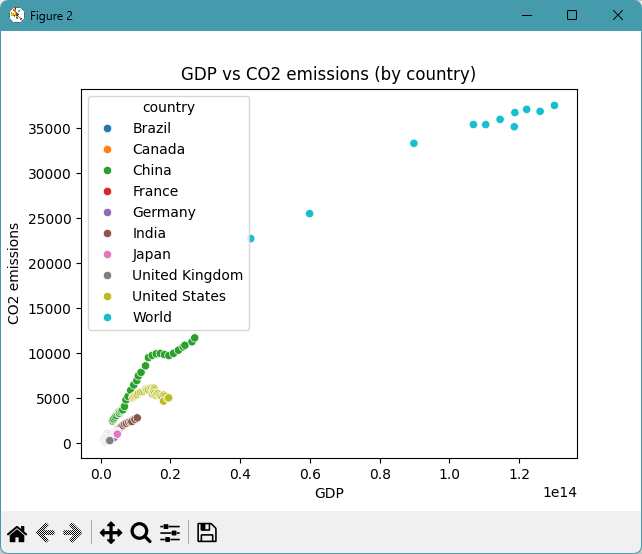
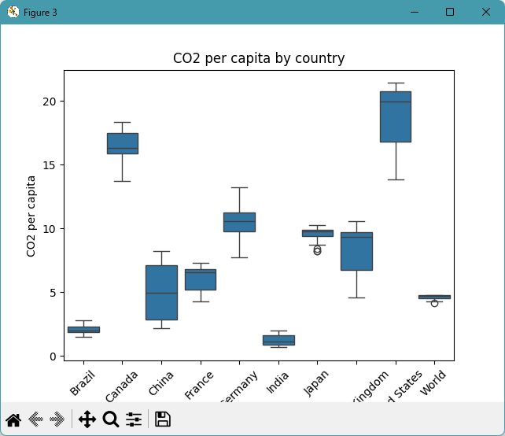

# datafun-06-applied

[](https://denisecase.github.io/pro-analytics-02/workflow-b-apply-example-project/)
[](./pyproject.toml)
[](./LICENSE)

> Professional Python project: applied data analytics.

## Project Goal

In this project, you perform a novel **Exploratory Data Analysis (EDA)**
using Jupyter notebooks or Python modules (your preference).
The addition of related data and/or SQL may be included and is optional.

Your goal: choose a new dataset, and explore it:
run checks, view distributions, identify missing values or outliers.
Create and present a custom project to explore a different tabular dataset.

For data suggestions, please see [data/raw/README.md](data/raw/README.md).

## Examples

The project includes an additional EDA on a real-world dataset.
Between this and the Module 4 example,
you should be able to see what parts are similar
(the general outline and workflow) and what changes with data.
The two projects together help create an appreciation
for the value of **reusable functions**.

## Working Files

You'll work with these areas:

- **data/raw** - raw data for exploration
- **docs/** - project narrative and documentation
- **src/** - supporting Python package modules
- **notebooks/** - interactive analysis
- **pyproject.toml** - update authorship & links
- **zensical.toml** - update authorship & links

## Instructions (pro-analytics-02)

Follow the
[step-by-step workflow guide](https://denisecase.github.io/pro-analytics-02/workflow-b-apply-example-project/)
to complete:

1. Phase 1. **Start & Run**
2. Phase 2. **Change Authorship**
3. Phase 3. **Read & Understand**
4. Phase 4. **Modify**
5. Phase 5. **Apply**

## Challenges

Challenges are expected.
Sometimes instructions may not quite match your operating system.
When issues occur, share screenshots, error messages, and details about what you tried.
Working through issues is part of implementing professional projects.

## Success

After completing Phase 1. **Start & Run**, you'll have your own GitHub project,
with the example notebook executed and committed,
and running the example script will print out:

```shell
========================
Executed successfully!
========================
```

A new file `project.log` will appear in the root project folder.

## Command Reference

<details>
<summary>Show command reference</summary>

### In a machine terminal (open in your `Repos` folder)

After you get a copy of this repo in your own GitHub account,
open a machine terminal in your `Repos` folder:

```shell
# Replace username with YOUR GitHub username.
git clone https://github.com/hasacco/datafun-06-applied

cd datafun-06-applied
code .
```

### In a VS Code terminal

These are listed for convenience.
For best results, follow the detailed instructions in
[pro-analytics-02 guide](https://denisecase.github.io/pro-analytics-02/).

```shell
uv self update
uv python pin 3.14
uv lock --upgrade
uv sync --extra dev --extra docs --upgrade

uvx pre-commit install

git add -A
uvx pre-commit run --all-files
# repeat if changes were made
uvx pre-commit run --all-files

# run the example module and verify the environment (.venv/)
uv run python -m datafun.app_case

# do chores
uv run python -m pyright
uv run python -m pytest
uv run python -m zensical build

# save progress
git add -A
git commit -m "update"
git push -u origin main
```

</details>

## Notes

- Use the **UP ARROW** and **DOWN ARROW** in the terminal to scroll through past commands.
- Use `CTRL+f` to find (and replace) text within a file.
- You do not need to add to or modify `tests/`. They are provided for example only.
- Many files are silent helpers. Explore as you like, but nothing is required.
- You do NOT not to understand everything; understanding builds naturally over time.

## Troubleshooting >>>

If you see something like this in your terminal: `>>>` or `...`
You accidentally started Python interactive mode.
It happens.
Press `Ctrl+c` (both keys together) or `Ctrl+Z` then `Enter` on Windows.

## Example Output (Can Remove this Section after You Verify)

```shell
 | INFO | P06 | --- Section 9: Summary and next steps ---
 | INFO | P06 | ========================
 | INFO | P06 | SUMMARY
 | INFO | P06 | ========================
 | INFO | P06 | Dataset: owid-co2-data-subset
 | INFO | P06 | Original rows: 350
 | INFO | P06 | Clean rows:    308
 | INFO | P06 | Groups found in country: ['Brazil', 'Canada', 'China', 'France', 'Germany', 'India', 'Japan', 'United Kingdom', 'United States', 'World']
 | INFO | P06 | ======================
 | INFO | P06 | Review the results.
 | INFO | P06 | Determine the strongest correlations.
 | INFO | P06 | ======================
 | INFO | P06 | Look for interesting patterns in the charts.
 | INFO | P06 | Repeat the process, exploring additional angles.
 | INFO | P06 | After finding interesting insights, conclude your analysis.
 | INFO | P06 | ======================
 | INFO | P06 | Include instructions and specifics in your README.md file.
 | INFO | P06 | Write up your narrative on your docs/index.md file.
 | INFO | P06 | Include your next step suggestions for further analysis or modeling.
 | INFO | P06 | ======================
 | INFO | P06 | ----- in a script, call plt.show() once at the end to display all charts -----
 | INFO | P06 | ----- in a script, close the chart windows (with the close button) to continue  -----
 | INFO | P06 | EDA workflow complete
 | INFO | P06 | IMPORTANT: This script creates chart windows.
 | INFO | P06 | Close any chart windows and terminate this process with CTRL+c as needed.
 | INFO | P06 | ========================
 | INFO | P06 | Executed successfully!
 | INFO | P06 | ========================
```

## Findings and Visuals

Take screenshots of your charts and provide them here with a discussion.
In Markdown, display a figure by using:
an exclamation mark immediately followed by square brackets containing a useful caption
immediately followed by parentheses containing the relative path to your figure.
Note: When you start typing the path with a dot (.) for "here, in this directory",
the IDE may help complete the path.

In your custom project, follow this example, but

- your figures and narrative should reflect your work,
- this `README.md` should include your commands, process, and visuals, and
- `docs/index.md` should include your narrative.

Remove unnecessary instructional comments in your custom files.

Update these figures to present interesting results from your custom project:






## Project Documentation

Additional instructions, terms, and project notes:

[docs/index.md](docs/index.md)

## Citation

[CITATION.cff](./CITATION.cff)

## License

[MIT](./LICENSE)

## Modification 6-18-26

The data set was filtered further, removing World from the list of used countries. This was done to focus in more on country statistics and create a smaller range on the visuals. Then, a 2 X 2 grid of boxplots was created to show each selected numerical column by country on a separate boxplot. This allows comparison of patterns between variables and noting of trends between countries. For instance, countries that had larger ranges of CO2 emissions tended to have larger ranges in GDP as well. Removal of "World" from countries also had a significant effect on the heatmap, which now shows only a strong correlation between CO2 emissions and GDP.

## Example Output 6-18-26

```shell
2026-06-18 16:11:21 | INFO | P06 | === RUN START ===
2026-06-18 16:11:21 | INFO | P06 | project=P06
2026-06-18 16:11:21 | INFO | P06 | repo_dir=datafun-06-applied
2026-06-18 16:11:21 | INFO | P06 | python=3.14.5
2026-06-18 16:11:21 | INFO | P06 | os=Windows 11
2026-06-18 16:11:21 | INFO | P06 | shell=powershell
2026-06-18 16:11:21 | INFO | P06 | cwd=.
2026-06-18 16:11:21 | INFO | P06 | github_actions=False
2026-06-18 16:11:21 | INFO | P06 | === RUN START ===
2026-06-18 16:11:21 | INFO | P06 | project=EDA
2026-06-18 16:11:21 | INFO | P06 | repo_dir=datafun-06-applied
2026-06-18 16:11:21 | INFO | P06 | python=3.14.5
2026-06-18 16:11:21 | INFO | P06 | os=Windows 11
2026-06-18 16:11:21 | INFO | P06 | shell=powershell
2026-06-18 16:11:21 | INFO | P06 | cwd=.
2026-06-18 16:11:21 | INFO | P06 | github_actions=False
2026-06-18 16:11:21 | INFO | P06 | ========================
2026-06-18 16:11:21 | INFO | P06 | START main()
2026-06-18 16:11:21 | INFO | P06 | ========================
2026-06-18 16:11:21 | INFO | P06 | --- Section 2: Load dataset: owid-co2-data-subset ---
2026-06-18 16:11:21 | INFO | P06 | Loading dataset: owid-co2-data-subset
2026-06-18 16:11:21 | INFO | P06 | Loaded: 350 rows, 14 columns
2026-06-18 16:11:21 | INFO | P06 | --- Section 3: Inspect shape and basic structure ---
2026-06-18 16:11:21 | INFO | P06 | Previewing first few rows of the dataset
2026-06-18 16:11:21 | DEBUG | P06 |
  country  year   population           gdp      co2  co2_per_capita  coal_co2  oil_co2  gas_co2  cement_co2  methane  \
0  Brazil  1990  149143223.0  1.185475e+12  218.658           1.466    37.095  151.775    7.484      11.062  365.410  
1  Brazil  1991  151724253.0  1.213090e+12  229.394           1.512    42.466  156.700    7.336      11.776  373.664  
2  Brazil  1992  154275077.0  1.221829e+12  233.601           1.514    41.203  163.252    7.983       9.770  379.587  
3  Brazil  1993  156794574.0  1.298221e+12  244.306           1.558    42.343  171.252    8.730      10.164  382.577  
4  Brazil  1994  159265011.0  1.391784e+12  254.002           1.595    43.664  179.165    8.985      10.086  391.601  

   nitrous_oxide  total_ghg  temperature_change_from_co2  
0        100.456   2105.299                        0.030  
1        103.996   2189.194                        0.031  
2        106.648   2267.928                        0.031  
3        110.082   2282.487                        0.032  
4        111.742   2672.895                        0.033  
2026-06-18 16:11:21 | INFO | P06 | Column names
2026-06-18 16:11:21 | DEBUG | P06 | ['country', 'year', 'population', 'gdp', 'co2', 'co2_per_capita', 'coal_co2', 'oil_co2', 'gas_co2', 'cement_co2', 'methane', 'nitrous_oxide', 'total_ghg', 'temperature_change_from_co2']
2026-06-18 16:11:21 | INFO | P06 | DataFrame info (types and non-null counts)
<class 'pandas.DataFrame'>
RangeIndex: 315 entries, 0 to 314
Data columns (total 14 columns):
 #   Column                       Non-Null Count  Dtype  
---  ------                       --------------  -----  
 0   country                      315 non-null    str  
 1   year                         315 non-null    int64  
 2   population                   315 non-null    float64
 3   gdp                          297 non-null    float64
 4   co2                          315 non-null    float64
 5   co2_per_capita               315 non-null    float64
 6   coal_co2                     315 non-null    float64
 7   oil_co2                      315 non-null    float64
 8   gas_co2                      315 non-null    float64
 9   cement_co2                   315 non-null    float64
 10  methane                      315 non-null    float64
 11  nitrous_oxide                315 non-null    float64
 12  total_ghg                    315 non-null    float64
 13  temperature_change_from_co2  315 non-null    float64
dtypes: float64(12), int64(1), str(1)
memory usage: 34.6 KB
2026-06-18 16:11:21 | INFO | P06 | Dataset shape: 315 rows, 14 columns
2026-06-18 16:11:21 | INFO | P06 | --- Section 4: Create Data Dictionary and Check Data Quality ---
2026-06-18 16:11:21 | INFO | P06 | Building starter data dictionary
2026-06-18 16:11:21 | DEBUG | P06 |
                         column    dtype  missing_count  missing_pct
0                       country      str              0         0.00
1                          year    int64              0         0.00
2                    population  float64              0         0.00
3                           gdp  float64             18         5.71
4                           co2  float64              0         0.00
5                co2_per_capita  float64              0         0.00
6                      coal_co2  float64              0         0.00
7                       oil_co2  float64              0         0.00
8                       gas_co2  float64              0         0.00
9                    cement_co2  float64              0         0.00
10                      methane  float64              0         0.00
11                nitrous_oxide  float64              0         0.00
12                    total_ghg  float64              0         0.00
13  temperature_change_from_co2  float64              0         0.00
2026-06-18 16:11:21 | INFO | P06 | Missing values per column:
2026-06-18 16:11:21 | INFO | P06 |
country                         0
year                            0
population                      0
gdp                            18
co2                             0
co2_per_capita                  0
coal_co2                        0
oil_co2                         0
gas_co2                         0
cement_co2                      0
methane                         0
nitrous_oxide                   0
total_ghg                       0
temperature_change_from_co2     0
dtype: int64
2026-06-18 16:11:21 | INFO | P06 | Checking missing values per column
2026-06-18 16:11:21 | DEBUG | P06 |
gdp                            18
country                         0
year                            0
population                      0
co2                             0
co2_per_capita                  0
coal_co2                        0
oil_co2                         0
gas_co2                         0
cement_co2                      0
methane                         0
nitrous_oxide                   0
total_ghg                       0
temperature_change_from_co2     0
dtype: int64
2026-06-18 16:11:21 | INFO | P06 | Duplicate rows detected: 0
2026-06-18 16:11:21 | INFO | P06 | Call describe() for numeric columns
2026-06-18 16:11:21 | DEBUG | P06 |
              year           co2  co2_per_capita    population           gdp
count   315.000000    315.000000      315.000000  3.150000e+02  2.970000e+02
mean   2007.000000   1988.832073        8.554498  3.725625e+08  5.126925e+12
std      10.115574   2601.191056        5.731717  4.816060e+08  5.219532e+12
min    1990.000000    218.658000        0.668000  2.778944e+07  8.202743e+11
25%    1998.000000    481.535000        2.836500  6.384713e+07  2.015547e+12
50%    2007.000000    800.823000        7.942000  1.270278e+08  2.945461e+12
75%    2016.000000   2292.178500       11.216000  3.276530e+08  4.852985e+12
max    2024.000000  12289.037000       21.398000  1.450936e+09  2.696602e+13

2026-06-18 16:11:21 | INFO | P06 | --- Section 5: Create a cleaned view for EDA ---
2026-06-18 16:11:21 | INFO | P06 | Creating cleaned view for EDA (dropping rows with key missing values)
2026-06-18 16:11:21 | DEBUG | P06 | Columns required to be non-missing: ['year', 'co2', 'co2_per_capita', 'population', 'gdp', 'country']
2026-06-18 16:11:21 | INFO | P06 | Original rows: 315
2026-06-18 16:11:21 | INFO | P06 | Clean rows:    297
2026-06-18 16:11:21 | INFO | P06 | Rows dropped:  18
2026-06-18 16:11:21 | INFO | P06 | --- Section 6: Descriptive statistics for numeric columns ---
2026-06-18 16:11:21 | INFO | P06 | --------------- Manual statistics ---------------
2026-06-18 16:11:21 | DEBUG | P06 | co2_per_capita Statistics (using numpy):
2026-06-18 16:11:21 | DEBUG | P06 |   Mean: 8.64
2026-06-18 16:11:21 | DEBUG | P06 |   Std Dev: 5.79
2026-06-18 16:11:21 | DEBUG | P06 |   Min: 0.67
2026-06-18 16:11:21 | DEBUG | P06 |   Max: 21.40
2026-06-18 16:11:21 | DEBUG | P06 |   Range: 20.73
2026-06-18 16:11:21 | INFO | P06 | --------------- Using pandas describe() method ---------------
2026-06-18 16:11:21 | INFO | P06 | Computing overall descriptive statistics
2026-06-18 16:11:21 | DEBUG | P06 |
                count          mean           std           min           25%           50%           75%  \
year            297.0  2.006000e+03  9.537975e+00  1.990000e+03  1.998000e+03  2.006000e+03  2.014000e+03  
co2             297.0  1.951604e+03  2.512394e+03  2.186580e+02  4.800580e+02  8.045420e+02  2.148052e+03  
co2_per_capita  297.0  8.640377e+00  5.799480e+00  6.680000e-01  2.830000e+00  8.213000e+00  1.126100e+01  
population      297.0  3.695191e+08  4.771640e+08  2.778944e+07  6.341737e+07  1.270647e+08  3.231154e+08  
gdp             297.0  5.126925e+12  5.219532e+12  8.202743e+11  2.015547e+12  2.945461e+12  4.852985e+12  

                         max  
year            2.022000e+03  
co2             1.171181e+04  
co2_per_capita  2.139800e+01  
population      1.426437e+09  
gdp             2.696602e+13  
2026-06-18 16:11:21 | INFO | P06 | --------------- Using pandas groupby() and agg() ---------------
2026-06-18 16:11:21 | INFO | P06 | Computing descriptive statistics by group
2026-06-18 16:11:21 | DEBUG | P06 |
                year                                co2                                                co2_per_capita  \
               count    mean      std   min   max count         mean          std       min        max          count  
country  
Brazil            33  2006.0  9.66954  1990  2022    33   386.024121    99.416512   218.658    556.526             33  
Canada            33  2006.0  9.66954  1990  2022    33   541.119818    39.995135   449.776    589.956             33  
China             33  2006.0  9.66954  1990  2022    33  6658.015455  3207.545348  2483.534  11711.808             33  
France            33  2006.0  9.66954  1990  2022    33   374.195273    40.136420   281.515    419.119             33  
Germany           33  2006.0  9.66954  1990  2022    33   855.715788    97.477463   647.177   1054.796             33  
India             33  2006.0  9.66954  1990  2022    33  1496.659909   717.113573   577.987   2831.132             33  
Japan             33  2006.0  9.66954  1990  2022    33  1210.712667    74.291661  1029.645   1311.876             33  
United Kingdom    33  2006.0  9.66954  1990  2022    33   506.447697    90.802625   311.118    609.413             33  
United States     33  2006.0  9.66954  1990  2022    33  5535.547455   377.675710  4689.954   6126.903             33  

                                                    population                                            \
                     mean       std     min     max      count          mean           std           min  
country  
Brazil           2.065606  0.352282   1.466   2.781         33  1.840960e+08  1.883102e+07  1.491432e+08  
Canada          16.459121  1.218597  13.733  18.344         33  3.303238e+07  3.291569e+06  2.778944e+07  
China            4.940697  2.137014   2.153   8.218         33  1.313988e+09  8.344915e+07  1.153583e+09  
France           6.095394  0.899886   4.272   7.318         33  6.179824e+07  3.078375e+06  5.699024e+07  
Germany         10.458455  1.275180   7.739  13.233         33  8.190820e+07  1.020909e+06  7.970796e+07  
India            1.227273  0.424370   0.668   1.986         33  1.162973e+09  1.736689e+08  8.649722e+08  
Japan            9.551061  0.540427   8.213  10.271         33  1.267329e+08  1.324991e+06  1.233998e+08  
United Kingdom   8.291152  1.868601   4.563  10.588         33  6.184516e+07  3.544911e+06  5.736787e+07  
United States   18.674636  2.286546  13.817  21.398         33  2.992977e+08  2.770057e+07  2.533734e+08  

                               gdp  
                         max count          mean           std           min           max  
country  
Brazil          2.103064e+08    33  2.262925e+12  7.097089e+11  1.185475e+12  3.187413e+12  
Canada          3.882126e+07    33  1.291902e+12  2.981411e+11  8.202743e+11  1.761296e+12  
China           1.426437e+09    33  1.171751e+13  7.417495e+12  3.385122e+12  2.696602e+13  
France          6.627741e+07    33  2.183964e+12  3.303561e+11  1.636208e+12  2.671569e+12  
Germany         8.408623e+07    33  3.049515e+12  5.985213e+11  2.015547e+12  3.909613e+12  
India           1.425423e+09    33  4.891528e+12  2.764509e+12  1.750993e+12  1.047625e+13  
Japan           1.281925e+08    33  4.368696e+12  3.311838e+11  3.699822e+12  4.852985e+12  
United Kingdom  6.817932e+07    33  2.080226e+12  3.617837e+11  1.488075e+12  2.624285e+12  
United States   3.415340e+08    33  1.429605e+13  3.052282e+12  9.224688e+12  1.949317e+13  
2026-06-18 16:11:21 | INFO | P06 |
Stacked view - easier to read in logs:
2026-06-18 16:11:22 | DEBUG | P06 |
                               count          mean           std           min           max
country  
Brazil         year               33  2.006000e+03  9.669540e+00  1.990000e+03  2.022000e+03
               co2                33  3.860241e+02  9.941651e+01  2.186580e+02  5.565260e+02
               co2_per_capita     33  2.065606e+00  3.522824e-01  1.466000e+00  2.781000e+00
               population         33  1.840960e+08  1.883102e+07  1.491432e+08  2.103064e+08
               gdp                33  2.262925e+12  7.097089e+11  1.185475e+12  3.187413e+12
Canada         year               33  2.006000e+03  9.669540e+00  1.990000e+03  2.022000e+03
               co2                33  5.411198e+02  3.999514e+01  4.497760e+02  5.899560e+02
               co2_per_capita     33  1.645912e+01  1.218597e+00  1.373300e+01  1.834400e+01
               population         33  3.303238e+07  3.291569e+06  2.778944e+07  3.882126e+07
               gdp                33  1.291902e+12  2.981411e+11  8.202743e+11  1.761296e+12
China          year               33  2.006000e+03  9.669540e+00  1.990000e+03  2.022000e+03
               co2                33  6.658015e+03  3.207545e+03  2.483534e+03  1.171181e+04
               co2_per_capita     33  4.940697e+00  2.137014e+00  2.153000e+00  8.218000e+00
               population         33  1.313988e+09  8.344915e+07  1.153583e+09  1.426437e+09
               gdp                33  1.171751e+13  7.417495e+12  3.385122e+12  2.696602e+13
France         year               33  2.006000e+03  9.669540e+00  1.990000e+03  2.022000e+03
               co2                33  3.741953e+02  4.013642e+01  2.815150e+02  4.191190e+02
               co2_per_capita     33  6.095394e+00  8.998860e-01  4.272000e+00  7.318000e+00
               population         33  6.179824e+07  3.078375e+06  5.699024e+07  6.627741e+07
               gdp                33  2.183964e+12  3.303561e+11  1.636208e+12  2.671569e+12
Germany        year               33  2.006000e+03  9.669540e+00  1.990000e+03  2.022000e+03
               co2                33  8.557158e+02  9.747746e+01  6.471770e+02  1.054796e+03
               co2_per_capita     33  1.045845e+01  1.275180e+00  7.739000e+00  1.323300e+01
               population         33  8.190820e+07  1.020909e+06  7.970796e+07  8.408623e+07
               gdp                33  3.049515e+12  5.985213e+11  2.015547e+12  3.909613e+12
India          year               33  2.006000e+03  9.669540e+00  1.990000e+03  2.022000e+03
               co2                33  1.496660e+03  7.171136e+02  5.779870e+02  2.831132e+03
               co2_per_capita     33  1.227273e+00  4.243703e-01  6.680000e-01  1.986000e+00
               population         33  1.162973e+09  1.736689e+08  8.649722e+08  1.425423e+09
               gdp                33  4.891528e+12  2.764509e+12  1.750993e+12  1.047625e+13
Japan          year               33  2.006000e+03  9.669540e+00  1.990000e+03  2.022000e+03
               co2                33  1.210713e+03  7.429166e+01  1.029645e+03  1.311876e+03
               co2_per_capita     33  9.551061e+00  5.404270e-01  8.213000e+00  1.027100e+01
               population         33  1.267329e+08  1.324991e+06  1.233998e+08  1.281925e+08
               gdp                33  4.368696e+12  3.311838e+11  3.699822e+12  4.852985e+12
United Kingdom year               33  2.006000e+03  9.669540e+00  1.990000e+03  2.022000e+03
               co2                33  5.064477e+02  9.080263e+01  3.111180e+02  6.094130e+02
               co2_per_capita     33  8.291152e+00  1.868601e+00  4.563000e+00  1.058800e+01
               population         33  6.184516e+07  3.544911e+06  5.736787e+07  6.817932e+07
               gdp                33  2.080226e+12  3.617837e+11  1.488075e+12  2.624285e+12
United States  year               33  2.006000e+03  9.669540e+00  1.990000e+03  2.022000e+03
               co2                33  5.535547e+03  3.776757e+02  4.689954e+03  6.126903e+03
               co2_per_capita     33  1.867464e+01  2.286546e+00  1.381700e+01  2.139800e+01
               population         33  2.992977e+08  2.770057e+07  2.533734e+08  3.415340e+08
               gdp                33  1.429605e+13  3.052282e+12  9.224688e+12  1.949317e+13
2026-06-18 16:11:22 | INFO | P06 | --- Section 7: Correlation matrix for numeric columns ---
2026-06-18 16:11:22 | INFO | P06 | Computing correlation matrix for numeric columns
2026-06-18 16:11:22 | INFO | P06 |
Correlation matrix:
2026-06-18 16:11:22 | DEBUG | P06 |
                    year       co2  co2_per_capita  population       gdp
year            1.000000  0.157804       -0.076181    0.072093  0.323736
co2             0.157804  1.000000        0.236925    0.594111  0.931043
co2_per_capita -0.076181  0.236925        1.000000   -0.450027  0.261192
population      0.072093  0.594111       -0.450027    1.000000  0.489849
gdp             0.323736  0.931043        0.261192    0.489849  1.000000
2026-06-18 16:11:22 | INFO | P06 | ---------Visualize Correlation Matrix as a Heatmap---------------
2026-06-18 16:11:22 | INFO | P06 |
CUSTOM: Update these notes and use Markdown cells to narrate and tell the story as you explore. For example:

Interpretation:

 - Values close to 1 (dark red) = strong positive correlation (both increase together)
 - Values close to -1 (dark blue) = strong negative correlation (one increases, other decreases)
 - Values close to 0 (white) = little or no linear relationship
 - The diagonal is always 1 (each variable correlates perfectly with itself)

From this heatmap, we can see that flipper_length_mm and body_mass_g show strong positive correlation (~0.87).

2026-06-18 16:11:22 | INFO | P06 | --- Section 8: Charts ---
2026-06-18 16:11:22 | INFO | P06 | ---- Creating Scatter Plot to see Relationships ------
2026-06-18 16:11:22 | INFO | P06 | ----   Use clean dataframe ---------------------------
2026-06-18 16:11:22 | INFO | P06 | ----   Set x to GDP -----------------------
2026-06-18 16:11:22 | INFO | P06 | ----   Set y to CO2 emissions --------------------------
2026-06-18 16:11:22 | INFO | P06 | ----   Set the hue (color mapping) to the group column --
2026-06-18 16:11:22 | INFO | P06 | ------ Creating Box Plot Grid to see Distribution: ----
2026-06-18 16:11:22 | INFO | P06 | ------   Using Selected Numerical Variables -----------
2026-06-18 16:11:22 | INFO | P06 | ------   Set x to the group column --------------------
2026-06-18 16:11:22 | INFO | P06 | ------   Set y to a numeric column --------------------
2026-06-18 16:11:22 | INFO | P06 | --- Section 9: Summary and next steps ---
2026-06-18 16:11:22 | INFO | P06 | ========================
2026-06-18 16:11:22 | INFO | P06 | SUMMARY
2026-06-18 16:11:22 | INFO | P06 | ========================
2026-06-18 16:11:22 | INFO | P06 | Dataset: owid-co2-data-subset
2026-06-18 16:11:22 | INFO | P06 | Original rows: 315
2026-06-18 16:11:22 | INFO | P06 | Clean rows:    297
2026-06-18 16:11:22 | INFO | P06 | Groups found in country: ['Brazil', 'Canada', 'China', 'France', 'Germany', 'India', 'Japan', 'United Kingdom', 'United States']
2026-06-18 16:11:22 | INFO | P06 | ======================
2026-06-18 16:11:22 | INFO | P06 | Review the results.
2026-06-18 16:11:22 | INFO | P06 | Determine the strongest correlations.
2026-06-18 16:11:22 | INFO | P06 | ======================
2026-06-18 16:11:22 | INFO | P06 | Look for interesting patterns in the charts.
2026-06-18 16:11:22 | INFO | P06 | Repeat the process, exploring additional angles.
2026-06-18 16:11:22 | INFO | P06 | After finding interesting insights, conclude your analysis.
2026-06-18 16:11:22 | INFO | P06 | ======================
2026-06-18 16:11:22 | INFO | P06 | Include instructions and specifics in your README.md file.
2026-06-18 16:11:22 | INFO | P06 | Write up your narrative on your docs/index.md file.
2026-06-18 16:11:22 | INFO | P06 | Include your next step suggestions for further analysis or modeling.
2026-06-18 16:11:22 | INFO | P06 | ======================
2026-06-18 16:11:22 | INFO | P06 | ----- in a script, call plt.show() once at the end to display all charts -----
2026-06-18 16:11:22 | INFO | P06 | ----- in a script, close the chart windows (with the close button) to continue  -----
2026-06-18 16:12:21 | INFO | P06 | EDA workflow complete
2026-06-18 16:12:21 | INFO | P06 | IMPORTANT: This script creates chart windows.
2026-06-18 16:12:21 | INFO | P06 | Close any chart windows and terminate this process with CTRL+c as needed.
2026-06-18 16:12:21 | INFO | P06 | ========================
2026-06-18 16:12:21 | INFO | P06 | Executed successfully!
2026-06-18 16:12:21 | INFO | P06 | ========================
```

[Figure 1 - Heatmap](docs/images/Figure_1_hasacco.png)
[Figure 2 - Scatterplot](docs/images/Figure_2_hasacco.png)
[Figure 3 - Boxplot Grid](docs/images/Figure_3_hasacco.png)
